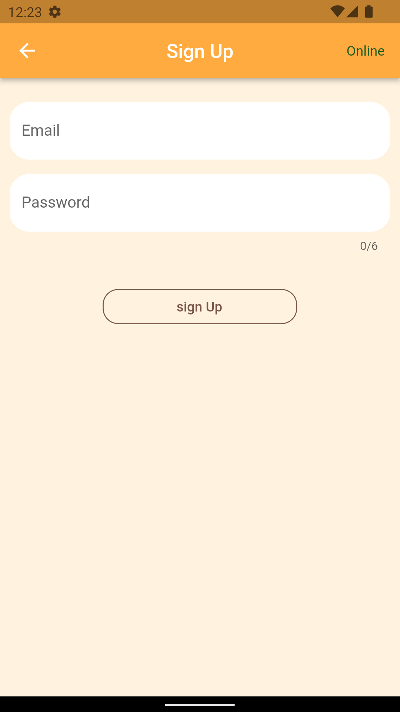
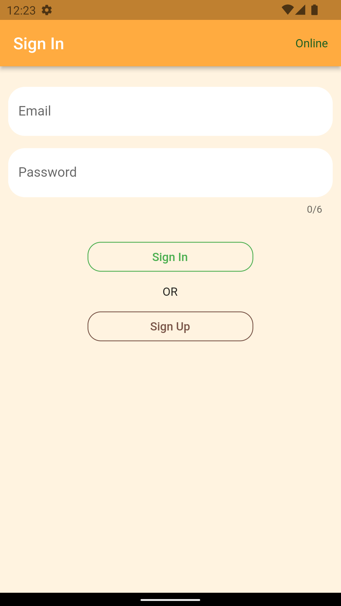
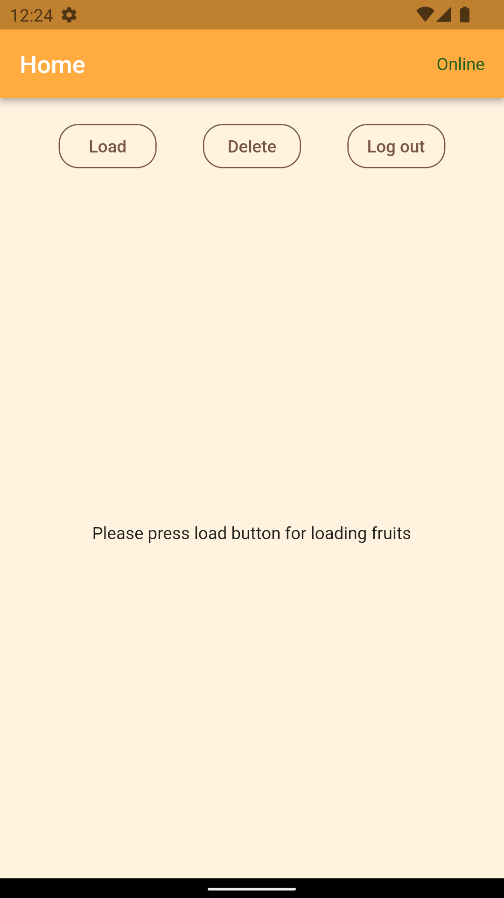
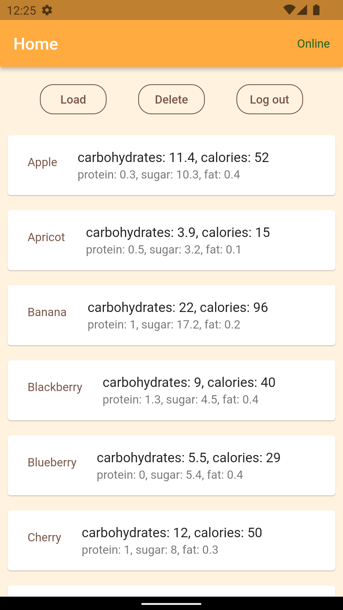
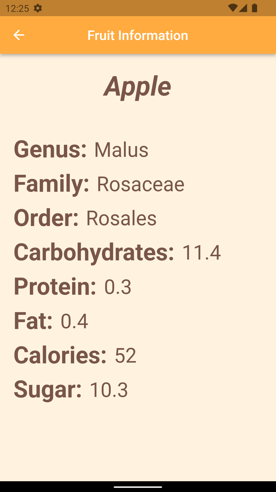
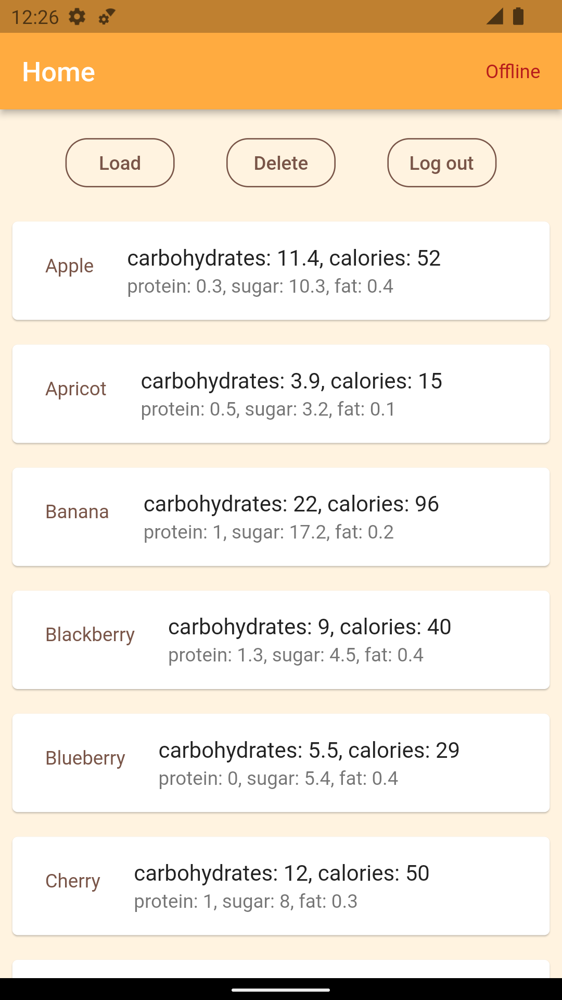
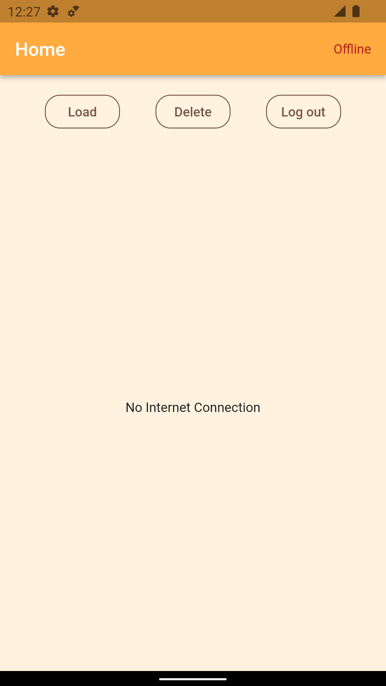
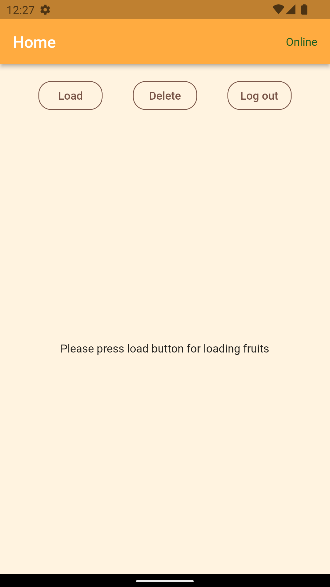

# fruitbook

This is a flutter application. This app read data from api and store them into sqlite database, when database fruit table is empty. When database fruit table is not empty it directly read data from the database and show them in the UI. So this app can run without the internet when database fruit table is not empty. This app also continuously check internet connection, so when database fruit table is empty the app won't read data from api without internet connection and alert user through UI.

## Components Used

- Android Studio
- Different flutter packages
  - sqflite (For sqlite database)
  - flutter_spinkit (For loading screen)
  - crypto (For password encryption and decryption)
  - email_validator (For email validation in correct format)
  - connectivity_plus (For checking Internet Connection)
  - http (For accessing API)

## Features of This App

- [Sign Up](#sign-up)
- [Sign In](#sign-in)
- [Home](#home)
- [Fruit Information Details](#fruit-information-details)
- [Network connectivity Check](#network-connectivity-check)
- [Logout](#logout)

## Features details with screenshots

### Sign Up

For Sign Up all possible scenario is also implemented, for example giving email in wrong format etc.

### Sign In

### Home

In home screen user have click load button to load fruit list. Depending on the situation mentioned above, it will either read data from the api then store them into the database and then read data from the database and show them into the screen or directly read data from the database and show them into the screen. User can also delete fruit data from the database by clicking delete button.

### Fruit Information Details

By clicking item from fruit list user can see details information about the fruit.

### Network connectivity Check

This app also continuously check internet connection and show network status in the UI.

### Logout

User can logout.

